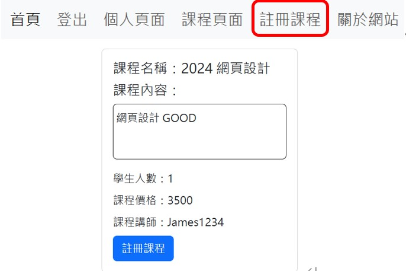
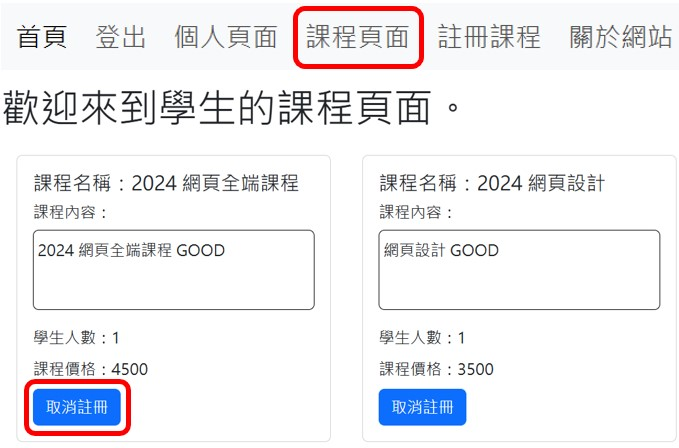

# 線上學習網站 (前端)  
1. 本專案為前、後端分離
2. 前端以React.js為框架，[後端](https://github.com/james-chiou/mern_project_server)則以Express.js為框架
## 目標
1. 使用React、Express、Node.js與MongoDB完成一個MERN專案
2. 模仿線上學習網站，老師可以開設課程，而學生能夠註冊想要學習的課程
## 使用套件
1. react
2. react-router-dom
3. axios
## 功能
1. React Components包含  
   1. 主頁面
   2. 註冊會員/登入會員
   3. 個人頁面/課程頁面
   4. 會員身份為 教師 
      * 新增課程頁面/編輯課程頁面
   6. 會員身份為 學生 
      * 註冊課程頁面
2. React Service包含  
   1. 會員資料相關(auth.service.js):
      * 登入/登出/註冊會員
      * 設定API與後端串連，其中Home_URL為localhost或是部署後的URL
        ```javascript
        const API_URL = "{Home_URL}/api/user"
        ```
   2. 課程相關(course.service.js):
      * 設定API與後端串連，其中Home_URL為localhost或是部署後的URL
        ```javascript
        const API_URL = "{Home_URL}/api/course"
        ```   
      1. 會員身份為 教師  
         * 新增課程/編輯課程內容/刪除課程  
           
      2. 會員身份為 學生  
         * 註冊課程/取消註冊課程  
           
           
3. 本專案使用[Render](https://render.com/)網站進行部署，前往[線上學習網站](https://mern-project-client-49t7.onrender.com)
## 注意事項
因Render網站的決策，本專案的Server不使用時會進入睡眠，所以在進行註冊/登入時會需要等待30秒以上。
